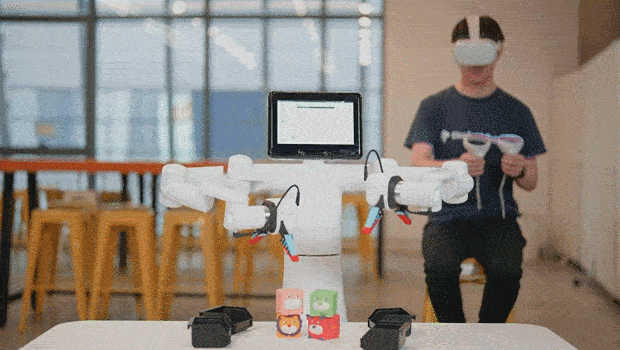
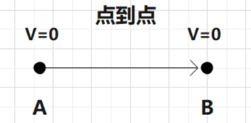
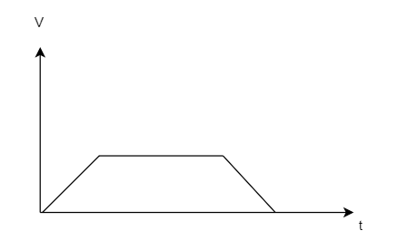
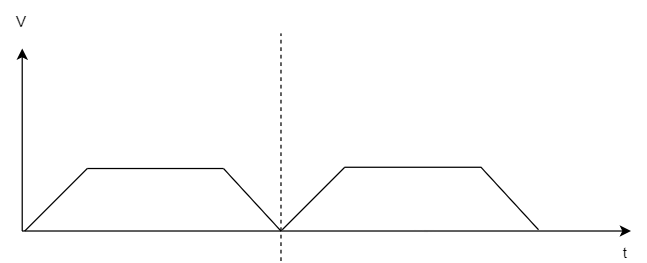
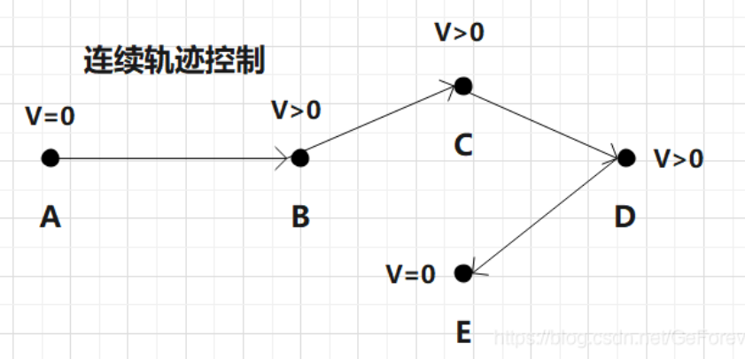
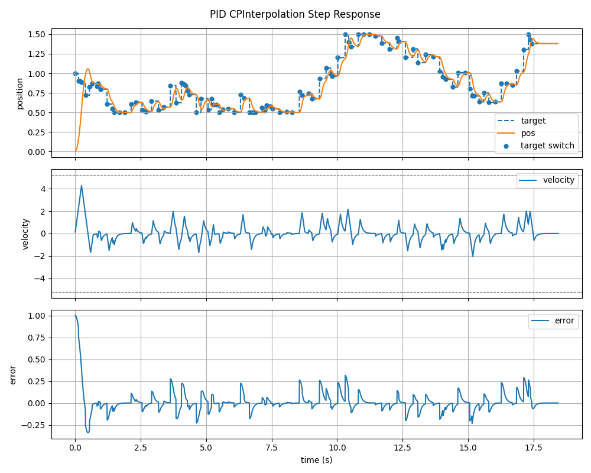
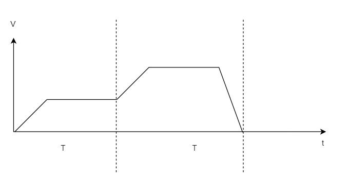

# RobotFollow

[中文](#中文) | [English](#english)

## 中文

RobotFollow 是 Mercury 系列机械臂的联动控制示例项目，面向鼠标、外骨骼、VR 等连续采样输入场景。项目支持 Mercury A1、B1、X1 等机型，重点演示 PTP、CP 和 FUSION 三类运动模式下的跟随控制。

## 快速开始

### 1. 安装依赖

```bash
pip install pymycobot pynput pyserial
```

### 2. 确认固件与烧录（20260508更新固件）

运行 CP/FUSION 跟随示例前，需要确认 `pymycobot` 版本和机械臂固件版本匹配，并且固件支持对应的运动模式。

建议先通过机械臂接口检查固件版本，例如：

```python
print(mc.get_modified_version())
print(mc.get_system_version())
```

固件烧录属于本机交互操作，需要用户在本机连接机械臂、选择正确串口、机型和固件文件后完成。
本项目中的固件为未上线的正式版，在CP模式中做了优化，建议烧录最新版固件:
```text
修复同步读写卡顿问题
mercury_firmware/MercuryX1_left_v2.1.1_20260508
mercury_firmware/MercuryX1_right_v2.1.1_20260508

resource/MercuryX1固件烧录方法
```

### 3. 创建配置文件

复制配置模板，并按你的设备修改串口、控制模式和发送周期：

```bash
cp config.example.json config.json
```


### 4. 确认串口

Linux 下常见串口示例：

```text
/dev/ttyAMA1
/dev/left_arm
/dev/right_arm
/dev/ttyACM2
```

如果串口权限不足，可以临时执行：

```bash
sudo chmod 666 /dev/ttyACM2
```

### 5. 运行示例

Mercury A1 鼠标坐标跟随：

```bash
python examples/mouse_a1_coords.py
```

Mercury A1 鼠标关节跟随：

```bash
python examples/mouse_a1_angles.py
```

Mercury X1 双臂鼠标坐标跟随：

```bash
python examples/mouse_x1_base.py
```

Mercury X1/B1 外骨骼角度跟随：

```bash
python examples/exoskeleton_x1_angles.py
```

Mercury A1 外骨骼角度跟随：

```bash
python examples/exoskeleton_a1_angles.py
```

双臂上下电顺序修复：

```bash
python examples/power_reset.py
```

所有示例默认读取 `config.json`，也可以显式指定配置文件：

```bash
python examples/mouse_a1_coords.py --config my_config.json
```

## 目录说明

```text
robot_follow/                 公共 Python 模块
  robot.py                    Mercury 初始化、上电、模式切换
  config.py                   JSON 配置读取
  samplers/mouse.py           鼠标采样器
  samplers/exoskeleton.py     外骨骼 API 兼容包装
  controllers/fusion.py       周期发送循环
  plot/sim_pid_step.py        CP模式中的位置规划

examples/                     推荐的新示例入口
  mouse_a1_coords.py
  mouse_a1_angles.py
  mouse_x1_base.py
  exoskeleton_x1_angles.py
  exoskeleton_a1_angles.py
  power_reset.py

resource/                     图片、动图、视频资源
config.example.json           串口和控制参数配置示例
```

## 配置文件

可以复制 `config.example.json` 保存自己的串口配置：

```json
{
  "single_arm_port": "/dev/ttyAMA1",
  "left_arm_port": "/dev/left_arm",
  "right_arm_port": "/dev/right_arm",
  "exoskeleton_port": "/dev/ttyACM2",
  "send_interval_ms": 10.0,
  "movement_type": 4,
  "kp": 16,
  "enable_read_angles": true,
  "read_angles_interval_ms": 100.0
}
```

当前示例采用配置优先。运行前请复制 `config.example.json` 为 `config.json`，并修改端口和参数。

`movement_type = 4` 表示使用 CP 模式。当前 examples 中的控制指令会把 `kp` 作为 CP 跟随参数下发，推荐默认值为 `16`。`Kp` 越大，机械臂对目标变化的响应越快；如果实际运动出现明显超调、冲过目标点、抖动或跟随过激，通常说明 `Kp` 偏大，可以先适当降低 `Kp`。

## 从旧版本迁移

旧目录中的 Python 脚本已经合并到新框架：

```text
mouse_follow/FUSION/mouse.py        -> examples/mouse_a1_coords.py
mouse_follow/CP/mouse_cp.py         -> examples/mouse_a1_coords.py
mouse_follow/FUSION/mouse_joint.py  -> examples/mouse_a1_angles.py
mouse_follow/CP/mouse_joint_cp.py   -> examples/mouse_a1_angles.py
mouse_follow/X1/mouse.py            -> examples/mouse_x1_base.py
mouse_follow/X1/speed.py            -> examples/mouse_x1_base.py
ex_mercury_follow/MercuryControl.py -> examples/exoskeleton_x1_angles.py
ex_mercury_follow/MercuryA1_Control.py -> examples/exoskeleton_a1_angles.py
ex_mercury_follow/power_reset.py    -> examples/power_reset.py
```


## 跟随效果

### 鼠标跟踪


### 外骨骼控制


### VR 控制



## 运动模式

### PTP 点位控制

PTP 是机械臂默认控制方式，机械臂以 0 起始速度和 0 终止速度运动到目标位置，适用于绝大多数点位运动场景。



速度规划曲线：



连续调用 PTP 指令时，运动衔接处会出现速度启停：



```python
set_movement_type(0)  # MovJ，坐标运动时执行非直线轨迹
set_movement_type(1)  # MovL，坐标运动时执行直线轨迹
```

PTP 支持多点位缓存，控制器会依次执行缓存中的运动指令。连续调用 PTP 指令时，运动衔接处会有启停。

### CP 连续轨迹控制（建议使用该模式）

CP 支持连续轨迹和速度衔接。控制器始终执行最新一条运动指令，指令衔接时不会强制降速到 0，等效于CANOPEN协议中的PP(bit5=1立即更新)模式



规划曲线：



图中离散目标点表示上位机连续输入的 `targetPos`，平滑曲线表示控制器每个控制周期返回的 `pos`。控制器不会让机械臂位置直接跳到目标点，而是在最大速度和最大加速度约束下逐步追踪，因此曲线会相对目标点存在合理滞后。

当目标点发生变化时，输出曲线会立即改变跟随趋势，但速度保持连续，不会在目标切换处突然归零或突变。如果目标点本身相对连续，输出曲线应平滑贴近目标；如果曲线明显冲过目标，通常是 `Kp` 过大导致的，可以先降低 `Kp`，必要时再增加少量 `Kd`。


```python
set_movement_type(4)
```

CP 不适合依赖多点位缓存的场景，更适合持续更新目标点的跟随控制。

在遥操作跟随场景中，CP 可以理解为一个在线跟随控制器：上位机每个采样周期发送最新的 `targetPos`，控制器每个控制周期返回一个新的 `pos`。如果连续输入相同目标，返回的 `pos` 会形成速度连续的轨迹；如果输入了新的目标，控制器会立即响应最新目标，但通过最大速度和最大加速度限制避免速度突变。

当前控制器的仿真脚本分为两类：

| 场景 | targetPos 单位 | 仿真脚本 | 推荐参数 |
| --- | --- | --- | --- |
| 关节 CP | rad | `robot_follow/plot/sim_pid_step.py` | `KP=12.0, KI=0.0, KD=0.05`，最大速度 `300 deg/s`，最大加速度 `1000 deg/s^2` |
| 坐标 CP | mm | `robot_follow/plot/sim_pid_step_mm.py` | `KP=6.0, KI=0.0, KD=0.04`，最大速度 `300 mm/s`，最大加速度 `600 mm/s^2` |

调参建议：

- 如果响应偏慢，优先增大 `Kp` 或最大加速度。
- 如果容易冲过目标，降低 `Kp` 或增加少量 `Kd`。
- 连续遥操作建议采样周期保持在 `10~20 ms`，目标点尽量平滑变化。

### FUSION 速度融合(不建议使用该模式)

FUSION 主要用于高速响应场景，它严格限制每段指令的执行周期，周期优先级高于最终位置精度，等效于CANOPEN协议中的IP(插值控制)模式。



```python
set_movement_type(2)  # 位置环融合，适用于更重视位置精度的 VR 控制
set_movement_type(3)  # 速度环融合，适用于外骨骼联动等低延迟场景
```

开启 FUSION 后，常用接口如下：

```python
send_angles(angles, time)
send_coords(coords, time)
send_base_coords(coords, time)
```

`time` 的单位是 7 ms。例如：

```python
send_angles([0, 0, 0, 0, 0, 0, 0], 3)
```

表示期望在 `3 * 7 = 21 ms` 内执行到目标附近。

## 参数建议

- `TI` 越小，响应越快，但过小可能导致运动不平滑。一般建议 `TI >= 3`。
- 采样周期建议 `10~20 ms`，发送频率不要超过 `100 Hz`。
- `_async=True` 表示发送指令后不等待机械臂完成，适合连续采样跟随；普通点位运动不建议默认使用。
- 速度环融合模式下，机械臂更关注采样点差分速度，长期运行可能产生位置累积误差。

## 常见问题

### 执行卡顿

- 如果采样器发送频率低于机械臂内部执行频率，缓存为空时会触发减速或急停。
- 如果采样点差分速度不平滑，位置环融合容易出现卡顿。
- 如果采样频率过高，速度环中的差分速度可能过小，也会导致跟随不明显。

### 位置误差

- FUSION 位置模式下，如果指定周期内无法抵达目标点，机械臂会运动到周期内可达的最远位置。
- FUSION 速度模式下可能产生累积误差。中断联动控制，待机械臂停止后重新进入跟随，可重新校准位置误差。

### 串口或模式切换失败

- 确认串口路径正确。
- 确认当前用户有串口访问权限。
- 确认 pymycobot 和机械臂固件版本满足对应示例要求。
- 调用 `get_movement_type()` 检查模式是否切换成功。
- 如果 `set_movement_type(2/3/4)` 不生效，优先检查固件是否已烧录到支持 CP/FUSION 的版本；固件过旧时，请通过 mystudio 或 `mercury_firmware/` 中的固件文件重新烧录。

## English

RobotFollow is a teleoperation example project for Mercury robotic arms. It targets continuous sampled inputs such as mouse control, exoskeleton control, and VR control. The project supports Mercury A1, B1, X1, and related models, and focuses on follow-control examples using PTP, CP, and FUSION motion modes.

## Quick Start

### 1. Install Dependencies

```bash
pip install pymycobot pynput pyserial
```

### 2. Confirm Firmware and Burning

Before running CP/FUSION follow examples, confirm that the `pymycobot` version matches the robot firmware version and that the firmware supports the required motion mode.

You can check the firmware version through the robot API:

```python
print(mc.get_modified_version())
print(mc.get_system_version())
```

Firmware burning is an interactive local operation. The user needs to connect the robot locally, select the correct serial port, robot model, and firmware file, then complete the burn process.

The firmware included in this project is an unreleased official version with CP mode optimizations. It is recommended to burn the latest firmware:

```text
Fix the issue of synchronous read and write lag
mercury_firmware/MercuryX1_left_v2.1.1_20260508
mercury_firmware/MercuryX1_right_v2.1.1_20260508

resource/MercuryX1固件烧录方法
```

### 3. Create the Config File

Copy the config template and adjust serial ports, motion mode, and send interval for your device:

```bash
cp config.example.json config.json
```

### 4. Confirm Serial Ports

Common Linux serial port examples:

```text
/dev/ttyAMA1
/dev/left_arm
/dev/right_arm
/dev/ttyACM2
```

If serial permission is insufficient, you can temporarily run:

```bash
sudo chmod 666 /dev/ttyACM2
```

### 5. Run Examples

Mercury A1 mouse-to-coordinate follow:

```bash
python examples/mouse_a1_coords.py
```

Mercury A1 mouse-to-joint follow:

```bash
python examples/mouse_a1_angles.py
```

Mercury X1 dual-arm mouse-to-base-coordinate follow:

```bash
python examples/mouse_x1_base.py
```

Mercury X1/B1 exoskeleton-to-joint follow:

```bash
python examples/exoskeleton_x1_angles.py
```

Mercury A1 exoskeleton-to-joint follow:

```bash
python examples/exoskeleton_a1_angles.py
```

Dual-arm power reset helper:

```bash
python examples/power_reset.py
```

All examples read `config.json` by default. You can also explicitly specify a config file:

```bash
python examples/mouse_a1_coords.py --config my_config.json
```

## Directory Layout

```text
robot_follow/                 Shared Python modules
  robot.py                    Mercury initialization, power, mode switching
  config.py                   JSON config loading
  samplers/mouse.py           Mouse sampler
  samplers/exoskeleton.py     Exoskeleton API compatibility wrapper
  controllers/fusion.py       Periodic send loop
  plot/sim_pid_step.py        Position planning used by CP mode

examples/                     Recommended example entry points
  mouse_a1_coords.py
  mouse_a1_angles.py
  mouse_x1_base.py
  exoskeleton_x1_angles.py
  exoskeleton_a1_angles.py
  power_reset.py

resource/                     Images, GIFs, and videos
config.example.json           Example serial and control parameters
```

## Configuration

Copy `config.example.json` to save your own serial configuration:

```json
{
  "single_arm_port": "/dev/ttyAMA1",
  "left_arm_port": "/dev/left_arm",
  "right_arm_port": "/dev/right_arm",
  "exoskeleton_port": "/dev/ttyACM2",
  "send_interval_ms": 10.0,
  "movement_type": 4,
  "kp": 16,
  "enable_read_angles": true,
  "read_angles_interval_ms": 100.0
}
```

The examples are config-first. Before running them, copy `config.example.json` to `config.json`, then adjust ports and parameters.

`movement_type = 4` enables CP mode. The examples send `kp` as the CP follow parameter, with `16` as the recommended default. A larger `Kp` makes the robot respond faster to target changes. If the real motion shows obvious overshoot, passing beyond the target, shaking, or overly aggressive tracking, `Kp` is usually too large and should be reduced first.

## Migration From Older Scripts

Old Python scripts have been merged into the new framework:

```text
mouse_follow/FUSION/mouse.py        -> examples/mouse_a1_coords.py
mouse_follow/CP/mouse_cp.py         -> examples/mouse_a1_coords.py
mouse_follow/FUSION/mouse_joint.py  -> examples/mouse_a1_angles.py
mouse_follow/CP/mouse_joint_cp.py   -> examples/mouse_a1_angles.py
mouse_follow/X1/mouse.py            -> examples/mouse_x1_base.py
mouse_follow/X1/speed.py            -> examples/mouse_x1_base.py
ex_mercury_follow/MercuryControl.py -> examples/exoskeleton_x1_angles.py
ex_mercury_follow/MercuryA1_Control.py -> examples/exoskeleton_a1_angles.py
ex_mercury_follow/power_reset.py    -> examples/power_reset.py
```

## Follow Effect

### Mouse Tracking


### Exoskeleton Control


### VR Control


## Motion Modes

### PTP Point-to-Point Control

PTP is the default control mode of the robot arm. The robot starts from zero velocity and ends at zero velocity when moving to the target position. It is suitable for most point-to-point motion scenarios.


Velocity planning curve:


When PTP commands are called continuously, the velocity stops and starts at command transitions:


```python
set_movement_type(0)  # MovJ. Coordinate motion follows a non-linear path.
set_movement_type(1)  # MovL. Coordinate motion follows a straight-line path.
```

PTP supports multi-point buffering. The controller executes buffered motion commands in sequence. Continuous PTP commands still introduce stop-start transitions.

### CP Continuous Path Control (Recommended)

CP supports continuous trajectories and velocity connection. The controller always executes the latest motion command and does not force the velocity to drop to zero at command transitions. It is equivalent to PP mode in CANopen with bit5 set to immediate update.


Planning curve:


In the figure, the discrete target points represent `targetPos` values continuously sent by the host computer. The smooth curve represents the `pos` returned by the controller at each control cycle. The controller does not jump the robot position directly to the target. Instead, it tracks gradually under maximum velocity and maximum acceleration limits, so a reasonable lag behind the target is expected.

When the target changes, the output curve immediately changes its following trend, while velocity remains continuous and does not suddenly reset to zero or jump at the target switch. If the target points are relatively continuous, the output curve should smoothly follow the target. If the curve clearly overshoots the target, `Kp` is usually too large. Reduce `Kp` first, then add a small amount of `Kd` if necessary.

```python
set_movement_type(4)
```

CP is not suitable for scenarios that depend on multi-point buffering. It is better suited for follow-control scenarios where the target point is updated continuously.

In teleoperation follow scenarios, CP can be understood as an online follow controller: the host sends the latest `targetPos` at every sampling cycle, and the controller returns a new `pos` at every control cycle. If the same target is continuously input, the returned `pos` values form a velocity-continuous trajectory. If a new target is input, the controller responds immediately to the latest target while using maximum velocity and maximum acceleration limits to avoid velocity jumps.

The current controller simulation scripts are:

| Scenario | targetPos Unit | Simulation Script | Recommended Parameters |
| --- | --- | --- | --- |
| Joint CP | rad | `robot_follow/plot/sim_pid_step.py` | `KP=12.0, KI=0.0, KD=0.05`, max velocity `300 deg/s`, max acceleration `1000 deg/s^2` |
| Coordinate CP | mm | `robot_follow/plot/sim_pid_step_mm.py` | `KP=6.0, KI=0.0, KD=0.04`, max velocity `300 mm/s`, max acceleration `600 mm/s^2` |

Tuning suggestions:

- If response is slow, increase `Kp` or maximum acceleration first.
- If the robot tends to overshoot, reduce `Kp` or add a small amount of `Kd`.
- For continuous teleoperation, keep the sampling period around `10~20 ms`, and keep target changes as smooth as possible.

### FUSION Velocity Fusion (Not Recommended)

FUSION is mainly for high-response scenarios. It strictly limits the execution period of each command, where timing has higher priority than final position accuracy. It is equivalent to IP mode in CANopen.


```python
set_movement_type(2)  # Position-loop fusion, useful for VR control that values position accuracy.
set_movement_type(3)  # Velocity-loop fusion, useful for low-latency exoskeleton linkage.
```

After enabling FUSION, common APIs are:

```python
send_angles(angles, time)
send_coords(coords, time)
send_base_coords(coords, time)
```

The unit of `time` is 7 ms. For example:

```python
send_angles([0, 0, 0, 0, 0, 0, 0], 3)
```

This means the robot is expected to move near the target within `3 * 7 = 21 ms`.

## Parameter Suggestions

- Smaller `TI` gives faster response, but a value that is too small can make motion less smooth. `TI >= 3` is generally recommended.
- Keep the sampling period around `10~20 ms`, and do not exceed `100 Hz`.
- `_async=True` means the command is sent without waiting for the robot to finish. This is suitable for continuous sampled follow control, but is not recommended as the default for normal point-to-point motion.
- In velocity-loop fusion mode, the robot pays more attention to differential velocity between samples, and long-running control may accumulate position error.

## FAQ

### Stuttering Motion

- If the sampler sends data slower than the robot internal execution frequency, the buffer may become empty and trigger deceleration or sudden stop.
- If the differential velocity between sampled points is not smooth, position-loop fusion can stutter.
- If the sampling frequency is too high, the differential velocity in velocity-loop mode may become too small, which can make following less obvious.

### Position Error

- In FUSION position mode, if the target cannot be reached within the specified period, the robot moves to the farthest reachable position within that period.
- FUSION velocity mode may accumulate position error. Stop linkage control and wait for the robot to stop, then re-enter follow control to recalibrate the position error.

### Serial Port or Mode Switching Failure

- Confirm that the serial port path is correct.
- Confirm that the current user has serial port access permission.
- Confirm that `pymycobot` and the robot firmware version satisfy the example requirements.
- Call `get_movement_type()` to check whether the mode switch succeeded.
- If `set_movement_type(2/3/4)` does not take effect, first check whether the firmware has been burned to a version that supports CP/FUSION. If the firmware is too old, burn the firmware again through mystudio or the firmware files in `mercury_firmware/`.